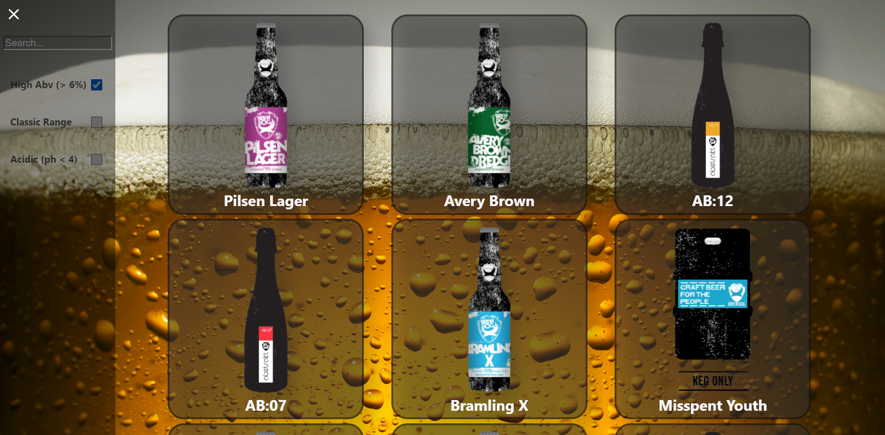

# Punk API
### By Lewis Halder
 

About
=====
This project visually represents the data held within the punk API.
It was built to aid my understanding of react so was made entirely within that library.
Along with tiles to portray key information about each beer I have included a nav menu. 
The menu includes a search bar which updates the beer list in realtime, and a choice of filters
to reduce the number of beers displayed based on specific criteria. 

 

Screenshots
===========

*Desktop View* 
 

 

 

